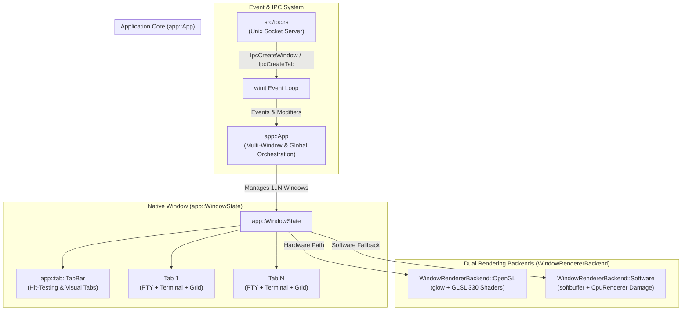
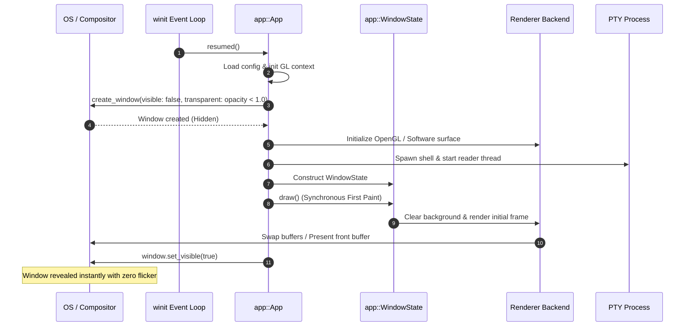

# Velox Architecture Documentation

## Overview

Velox is a modular, high-performance terminal emulator built around focused, decoupled Rust modules. The system architecture coordinates an event-driven multi-window/multi-tab application runtime, asynchronous pseudo-terminal (PTY) streams, VT/ANSI protocol engines, dual rendering pipelines (Hardware OpenGL and pure-Rust CPU Software), synthetic typography fallbacks, bounded memory paging, and single-instance IPC.

## Architectural Principles

```text
1. Single Responsibility: Each module strictly owns one functional domain.
2. Dual Rendering Parity: OpenGL and CPU software renderers produce identical visual output.
3. Zero-Allocation Hot Paths: Reuse vertex buffers, cell buffers, and scratch pixel vectors.
4. Bounded Memory Budgets: Fallback fonts, scrollback history, and glyph caches enforce strict limits.
5. Async/Non-Blocking I/O: PTY readers run on dedicated threads communicating via event loop proxies.
6. Zero-Flicker Presentation: Windows render their initial frame synchronously before being mapped.
7. Modular Isolation: Screen grids, tabs, and font sizes operate in clean isolation per tab.
```

## Component Architecture



---

## Core Subsystems

### 1. Application & Window Orchestration (`app::`)

- **`App`**: The top-level `winit::application::ApplicationHandler` managing all active `WindowId -> WindowState` instances, GL display/context initialization, modifier states, single-instance daemon mode, and IPC listener handles.
- **`WindowState`**: Represents an open native window. Owns the active `WindowRendererBackend`, mouse/keyboard interaction state, tab list (`Vec<Tab>`), active tab index, tab bar layout (`TabBar`), render buffers, frame limiter, and window opacity/dimming parameters.
- **`Tab` (`app/tab.rs`)**: Owns an individual tab's execution context: dedicated PTY master, background reader thread, `Terminal` state machine, custom title, hold-on-exit flag, and isolated tab zoom font size.
- **`TabBar` (`app/tab.rs`)**: Manages tab bar layout, visibility modes (`Auto`, `Always`, `Never`), close/new-tab button hit testing, hover states, and generates render metadata (`TabBarRenderInfo`).

### 2. Dual Rendering Backends (`renderer::`)

Velox provides two full-featured renderers sharing identical layout and visual parity:

#### A. Hardware OpenGL Renderer (`renderer::Renderer`)
- Utilizes `glow` on an OpenGL 3.3+ core profile.
- Single dynamic glyph texture atlas for ASCII, Nerd Fonts, and Unicode symbols.
- Two-pass vertex batching: Pass 1 renders background colored quads; Pass 2 renders textured glyph quads, cursor shapes, and line decorations.
- GPU clear with premultiplied alpha for seamless transparency support (`opacity`).

#### B. CPU Software Renderer (`renderer::software::CpuRenderer`)
- Pure-Rust CPU blitting directly to a 32-bit ARGB `Framebuffer` presented via `softbuffer`.
- Fine-grained `DamageMap` row tracking: only dirty terminal rows and damaged glyph spans are redrawn, achieving near-zero CPU usage when idle.
- Full line decoration suite (`decorations.rs`): single, double, curly, dotted, and dashed underlines, strikethrough, block/beam/hollow cursors, and unfocused dimming.
- Fast-path box and block drawing primitives (`primitives.rs`).

### 3. Typography & Synthetic Italic Engine (`font::`)

- **`ResolvedFontSet` (`font/resolved.rs`)**: Resolves regular, bold, italic, and bold-italic font faces.
- **Synthetic Italic Shearing (`shear_outline`)**: When an italic font variant is missing on the system, Velox dynamically shears the vector outlines of regular glyphs using horizontal shearing matrices and adjusts bounding boxes to prevent clipping.
- **`FallbackManager` (`font/fallback.rs`)**: Automatically discovers missing glyphs across system fonts (Nerd Fonts, Powerline, emoji fonts) with an LRU cache bounded by a strict memory budget (`MAX_FALLBACK_BYTES = 64MB`).
- **`SYSTEM_FONT_DB`**: Process-wide shared `fontdb::Database` initialized once to eliminate redundant font directory parsing across windows and tabs.

### 4. Terminal State & ANSI Parsing (`terminal::`, `ansi::`)

- **Byte Stream Parser (`ansi/`)**: Zero-allocation state machine decoding ANSI, CSI, OSC, and DCS byte sequences.
- **`Terminal` (`terminal/terminal.rs`)**: Maintains active and alternate screen grids, cursor positions, graphic rendition attributes (SGR), bracketed paste, synchronized output, focus tracking, and semantic prompt markers (OSC-133).
- **Hyperlink Engine (`hyperlink/`)**: Detects explicit OSC-8 hyperlinks and implicit HTTP(S) URLs with interactive mouse hover and click-to-open handlers.

### 5. Screen Buffers & Infinite Scrollback (`screen::`)

- **`Grid` (`screen/grid.rs`)**: Two-dimensional character cell array storing `Cell` entries (character, fg color, bg color, `CellFlags`). Supports wide characters (emojis, CJK), cursor placement, and full line reflow on resize.
- **Chunked Infinite Scrollback (`screen/scrollback.rs`)**: Paged scrollback architecture that stores history in contiguous chunks with bounded RAM cache and disk backing, allowing millions of lines of history without unbounded memory growth.
- **`Selection` (`screen/selection.rs`)**: Multi-mode text selection (character, word, line) supporting normal and alternate grids with clipboard copy integration.

### 6. Memory Management & Allocator Trimming (`src/memory.rs`)

- **Allocator Trimming (`trim_allocator_memory`)**: Automatically calls OS-level memory trim functions (e.g. `malloc_trim` on Linux glibc) when tabs close or after 2.5 seconds of PTY inactivity.
- **Buffer Retention Limits**: Vertex buffers and render cell buffers shrink when capacities exceed 2x normal viewport needs, preventing heap bloat after viewing dense burst outputs.

### 7. Single-Process IPC Architecture (`src/ipc.rs`)

- Display-isolated Unix domain socket server running on the main event loop.
- Supports CLI commands `velox msg create-window` and `velox msg create-tab` to launch new windows or tabs in an existing running Velox process in under 3ms.

---

## Data Flow & Lifecycle

### 1. Zero-Flicker Cold Startup Sequence



### 2. Runtime Execution Loop & I/O Pipeline

```mermaid
flowchart LR
    subgraph PTYStream["PTY Background Stream"]
        Shell["Shell / Subprocess"]
        PTYMaster["PTY Master Descriptor"]
        PTYReader["Dedicated Reader Thread"]
        Shell <--> PTYMaster
        PTYMaster --> PTYReader
    end

    subgraph EventLoop["Main Thread (winit Event Loop)"]
        Proxy["EventLoopProxy<br/>(CustomEvent::PtyData)"]
        Parser["ansi::Parser<br/>(VT / CSI / OSC Byte Stream)"]
        Term["terminal::Terminal<br/>(Grid & Alternate Screen)"]
        PTYReader -->|Bytes| Proxy
        Proxy --> Parser
        Parser --> Term
    end

    subgraph RenderSubsystem["Rendering & Presentation"]
        Damage["screen::DamageMap / Dirty Grid"]
        Renderer["Renderer / CpuRenderer"]
        Surface["Display Surface<br/>(OpenGL / softbuffer)"]
        Term --> Damage
        Damage --> Renderer
        Renderer --> Surface
    end
```



---

## Testing & Quality Assurance

Velox maintains a test suite covering:
- Terminal emulation compliance, CSI/OSC/DCS escape sequences, SGR color resolution, and alternate screens.
- Tab management, per-tab font zoom isolation, and hit testing.
- Infinite scrollback paging, chunk flushing, and bounded RAM stability under 1,000,000+ line stress.
- Synthetic italic outline shearing math and font fallback eviction budgets.
- CPU software renderer damage tracking, blitting, and line decorations.

