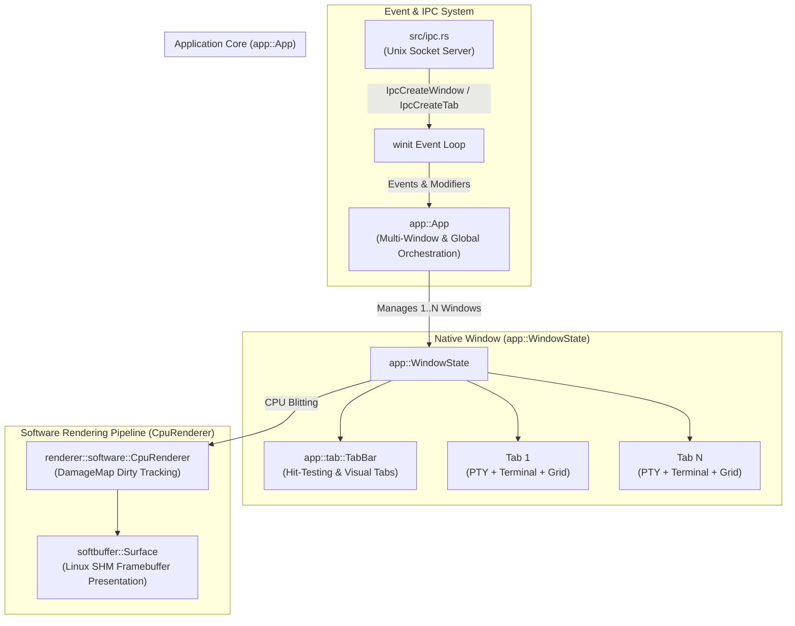
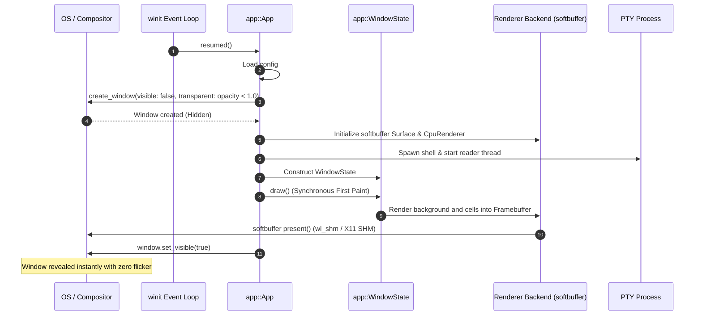

# Velox Architecture Documentation

## Overview

Velox is a modular, high-performance terminal emulator built around focused, decoupled Rust modules. The system architecture coordinates an event-driven multi-window/multi-tab application runtime, asynchronous pseudo-terminal (PTY) streams, VT/ANSI protocol engines, a pure-Rust CPU software rendering pipeline via `softbuffer`, synthetic typography fallbacks, bounded memory paging, and single-instance IPC.

## Architectural Principles

```text
1. Single Responsibility: Each module strictly owns one functional domain.
2. Software-Only Rendering: Pure CPU rasterization and composition without GPU dependencies.
3. Zero-Allocation Hot Paths: Reuse cell buffers and scratch pixel vectors.
4. Bounded Memory Budgets: Fallback fonts, scrollback history, and glyph caches enforce strict limits.
5. Async/Non-Blocking I/O: PTY readers run on dedicated threads communicating via event loop proxies.
6. Zero-Flicker Presentation: Windows render their initial frame synchronously before being mapped.
7. Modular Isolation: Screen grids, tabs, and font sizes operate in clean isolation per tab.
```

## Component Architecture


```mermaid
flowchart TD
    subgraph EventSystem["Event & IPC System"]
        Winit["winit Event Loop"]
        IPC["src/ipc.rs<br/>(Unix Socket Server)"]
        Winit -->|Events & Modifiers| App
        IPC -->|IpcCreateWindow / IpcCreateTab| Winit
    end

    subgraph AppCore["Application Core (app::App)"]
        App["app::App<br/>(Multi-Window & Global Orchestration)"]
    end

    subgraph WindowInstance["Native Window (app::WindowState)"]
        WS["app::WindowState"]
        TabBar["app::tab::TabBar<br/>(Hit-Testing & Visual Tabs)"]
        Tab1["Tab 1<br/>(PTY + Terminal + Grid)"]
        TabN["Tab N<br/>(PTY + Terminal + Grid)"]
        WS --> TabBar
        WS --> Tab1
        WS --> TabN
    end

    subgraph SoftwareRendering["Software Rendering Pipeline (CpuRenderer)"]
        SoftRenderer["renderer::software::CpuRenderer<br/>(DamageMap Dirty Tracking)"]
        SoftSurface["softbuffer::Surface<br/>(Linux SHM Framebuffer Presentation)"]
        SoftRenderer --> SoftSurface
    end

    App -->|Manages 1..N Windows| WS
    WS -->|CPU Blitting| SoftRenderer
```

---

## Core Subsystems

### 1. Platform Windowing & Desktop Identity (`src/platform.rs`)

- **Authoritative Backend Detection**: Uses Winit 0.30 extension traits (`ActiveEventLoopExtWayland::is_wayland`, `ActiveEventLoopExtX11::is_x11`) to determine the live windowing protocol at runtime, with environment fallback hints (`WAYLAND_DISPLAY`, `XDG_SESSION_TYPE`, `DISPLAY`).
- **Canonical Identity Compliance**:
  - Wayland `app_id`: `io.github.lnoxsian.Velox` (configured via `WindowAttributesExtWayland::with_name`).
  - X11 `WM_CLASS`: `("velox", "io.github.lnoxsian.Velox")` matching the freedesktop standard (`WindowAttributesExtX11::with_name`).
  - Desktop Entry: `io.github.lnoxsian.Velox.desktop` with `StartupWMClass=io.github.lnoxsian.Velox`.
  - Icon theme lookup: `io.github.lnoxsian.Velox` matching installed SVG and hicolor PNG icons.

### 2. Application & Window Orchestration (`app::`)

- **`App`**: The top-level `winit::application::ApplicationHandler` managing all active `WindowId -> WindowState` instances, modifier states, single-instance daemon mode, and IPC listener handles.
- **`WindowState`**: Represents an open native window. Owns the `CpuRenderer`, `softbuffer::Surface`, mouse/keyboard interaction state, tab list (`Vec<Tab>`), active tab index, tab bar layout (`TabBar`), render buffers, frame limiter, and window opacity/dimming parameters.
- **`Tab` (`app/tab.rs`)**: Owns an individual tab's execution context: dedicated PTY master, background reader thread, `Terminal` state machine, custom title, hold-on-exit flag, and isolated tab zoom font size.
- **`TabBar` (`app/tab.rs`)**: Manages tab bar layout, visibility modes (`Auto`, `Always`, `Never`), close/new-tab button hit testing, hover states, and generates render metadata (`TabBarRenderInfo`).

### 3. Display Connection & Window Creation (`renderer::backend`)

Velox initializes native Linux windows and display surfaces via `create_window_and_renderer`:

- **Winit Windowing**: Creates windows with explicit Wayland/X11 attributes, initially hidden for zero cold-start flicker.
- **`softbuffer` Surface**: Binds a CPU-accessible shared memory presentation surface (`wl_shm` on Wayland or X11 MIT-SHM on X11) directly to the window.
- **Zero-Size Protection**: Both surface creation and resizing guard against zero width or height by clamping dimensions with `NonZeroU32`, preventing driver panics on Wayland compositors during minimize/unmap transitions.
- **Diagnostics (`src/diagnostics.rs`)**: Standalone system checks inspecting Linux display server connection, font database status, and desktop integration without GPU dependencies.

### 4. Pure CPU Software Renderer (`renderer::software::CpuRenderer`)

- Pure-Rust CPU blitting directly to a 32-bit linear ARGB `Framebuffer` presented via `softbuffer`.
- Fine-grained `DamageMap` row tracking: only dirty terminal rows and damaged glyph spans are redrawn, achieving near-zero CPU usage when idle.
- Full line decoration suite (`decorations.rs`): single, double, curly, dotted, and dashed underlines, strikethrough, block/beam/hollow cursors, and unfocused dimming.
- Fast-path box and block drawing primitives (`primitives.rs`).
- High-efficiency alpha blitters (`raster.rs`) for glyph rasterization onto the CPU buffer.

### 5. Typography & Synthetic Italic Engine (`font::`)

- **`ResolvedFontSet` (`font/resolved.rs`)**: Resolves regular, bold, italic, and bold-italic font faces.
- **Synthetic Italic Shearing (`shear_outline`)**: When an italic font variant is missing on the system, Velox dynamically shears the vector outlines of regular glyphs using horizontal shearing matrices and adjusts bounding boxes to prevent clipping.
- **`FallbackManager` (`font/fallback.rs`)**: Automatically discovers missing glyphs across system fonts (Nerd Fonts, Powerline, emoji fonts) with an LRU cache bounded by a strict memory budget (`MAX_FALLBACK_BYTES = 64MB`).
- **`SYSTEM_FONT_DB`**: Process-wide shared `fontdb::Database` initialized once to eliminate redundant font directory parsing across windows and tabs.

### 6. Terminal State & ANSI Parsing (`terminal::`, `ansi::`)

- **Byte Stream Parser (`ansi/`)**: Zero-allocation state machine decoding ANSI, CSI, OSC, and DCS byte sequences.
- **`Terminal` (`terminal/terminal.rs`)**: Maintains active and alternate screen grids, cursor positions, graphic rendition attributes (SGR), bracketed paste, synchronized output, focus tracking, and semantic prompt markers (OSC-133).
- **Hyperlink Engine (`hyperlink/`)**: Detects explicit OSC-8 hyperlinks and implicit HTTP(S) URLs with interactive mouse hover and click-to-open handlers.

### 7. Screen Buffers & Infinite Scrollback (`screen::`)

- **`Grid` (`screen/grid.rs`)**: Two-dimensional character cell array storing `Cell` entries (character, fg color, bg color, `CellFlags`). Supports wide characters (emojis, CJK), cursor placement, and full line reflow on resize.
- **Chunked Infinite Scrollback (`screen/scrollback.rs`)**: Paged scrollback architecture that stores history in contiguous chunks with bounded RAM cache and disk backing, allowing millions of lines of history without unbounded memory growth.
- **`Selection` (`screen/selection.rs`)**: Multi-mode text selection (character, word, line) supporting normal and alternate grids with clipboard copy integration.

### 8. Memory Management & Allocator Trimming (`src/memory.rs`)

- **Allocator Trimming (`trim_allocator_memory`)**: Automatically calls OS-level memory trim functions (e.g. `malloc_trim` on Linux glibc) when tabs close or after 2.5 seconds of PTY inactivity.
- **Buffer Retention Limits**: Render cell buffers shrink when capacities exceed 2x normal viewport needs, preventing heap bloat after viewing dense burst outputs.

### 9. Single-Process IPC Architecture (`src/ipc.rs`)

- Display-isolated Unix domain socket server running on the main event loop.
- Supports CLI commands `velox msg create-window` and `velox msg create-tab` to launch new windows or tabs in an existing running Velox process in under 3ms.

---

## Data Flow & Lifecycle

### 1. Zero-Flicker Cold Startup Sequence


```mermaid
sequenceDiagram
    autonumber
    participant OS as OS / Compositor
    participant Winit as winit Event Loop
    participant App as app::App
    participant WS as app::WindowState
    participant Backend as Renderer Backend (softbuffer)
    participant PTY as PTY Process

    Winit->>App: resumed()
    App->>App: Load config
    App->>OS: create_window(visible: false, transparent: opacity < 1.0)
    OS-->>App: Window created (Hidden)
    App->>Backend: Initialize softbuffer Surface & CpuRenderer
    App->>PTY: Spawn shell & start reader thread
    App->>WS: Construct WindowState
    App->>WS: draw() (Synchronous First Paint)
    WS->>Backend: Render background and cells into Framebuffer
    Backend->>OS: softbuffer present() (wl_shm / X11 SHM)
    App->>OS: window.set_visible(true)
    Note over OS: Window revealed instantly with zero flicker
```

### 2. Runtime Execution Loop & I/O Pipeline


```mermaid
flowchart LR
    subgraph PTYStream["PTY Background Stream"]
        Shell["Shell / Subprocess"]
        PTYMaster["PTY Master Descriptor"]
        PTYReader["Dedicated Reader Thread"]
        Shell <--> PTYMaster
        PTYMaster --> PTYReader
    end

    subgraph EventLoop["Main Thread (winit Event Loop)"]
        Proxy["EventLoopProxy<br/>(CustomEvent::PtyData)"]
        Parser["ansi::Parser<br/>(VT / CSI / OSC Byte Stream)"]
        Term["terminal::Terminal<br/>(Grid & Alternate Screen)"]
        PTYReader -->|Bytes| Proxy
        Proxy --> Parser
        Parser --> Term
    end

    subgraph RenderSubsystem["Rendering & Presentation"]
        Damage["screen::DamageMap / Dirty Grid"]
        Renderer["renderer::software::CpuRenderer"]
        Surface["Display Surface<br/>(softbuffer SHM)"]
        Term --> Damage
        Damage --> Renderer
        Renderer --> Surface
    end
```

---

## Testing & Quality Assurance

Velox maintains a test suite covering:
- Terminal emulation compliance, CSI/OSC/DCS escape sequences, SGR color resolution, and alternate screens.
- Tab management, per-tab font zoom isolation, and hit testing.
- Infinite scrollback paging, chunk flushing, and bounded RAM stability under 1,000,000+ line stress.
- Synthetic italic outline shearing math and font fallback eviction budgets.
- CPU software renderer damage tracking, blitting, and line decorations.

